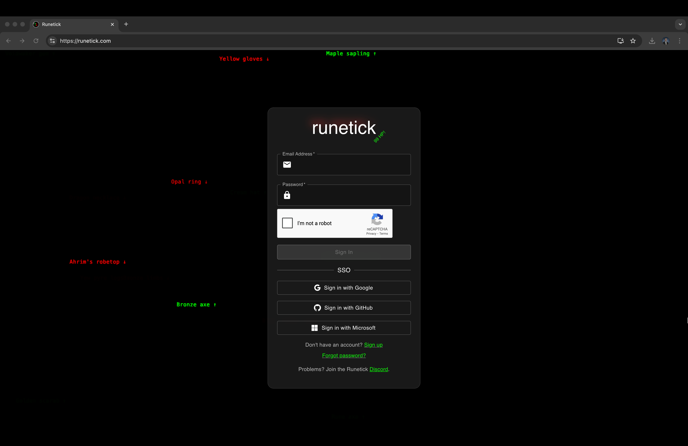
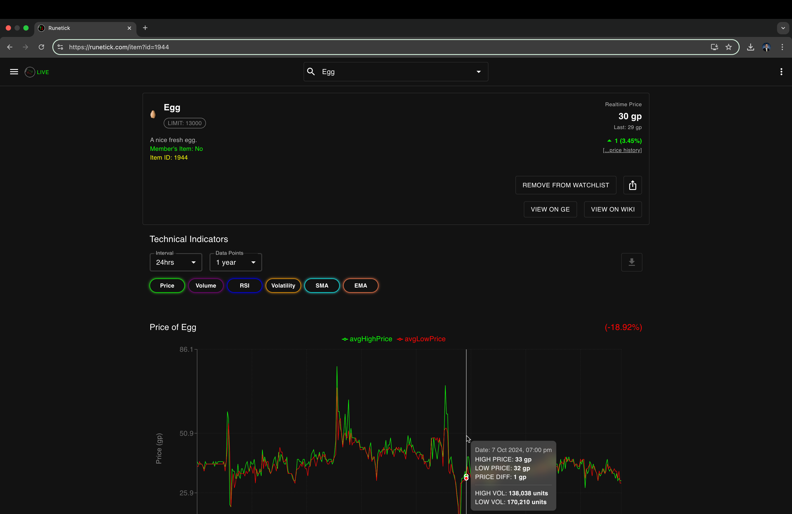
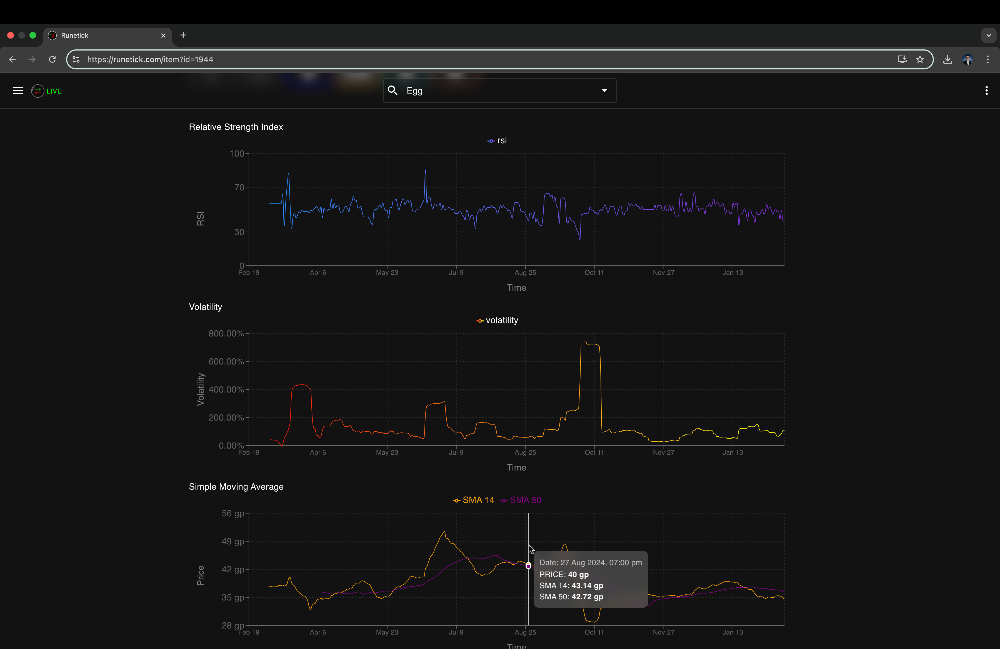
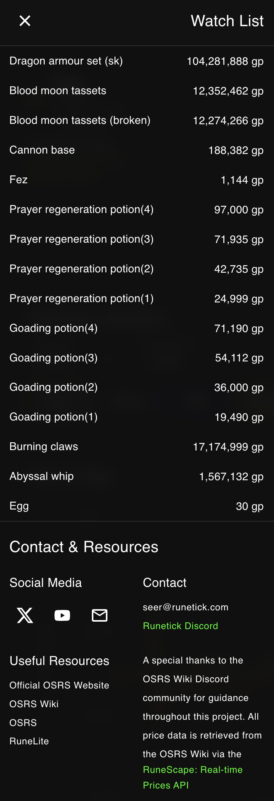
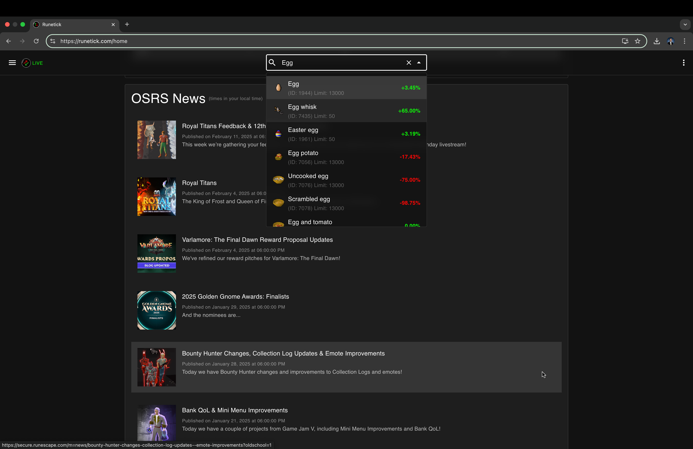
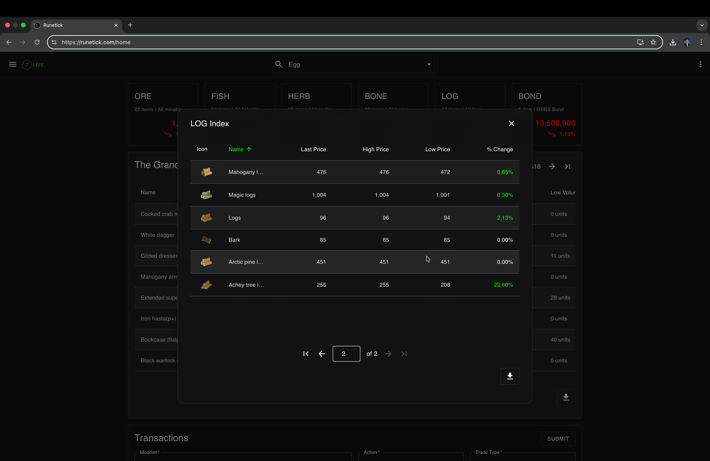

# runetick‑v1‑services‑portfolio

**runetick** is a next‑gen OSRS trading platform that brings the Grand Exchange to life with real‑time data, technical analysis, and seamless trading tools—all wrapped up in a sleek, modern interface. 🚀💎

Built to overcome rate‑limits and provide sub‑second updates, runetick’s backend fetches live GE data from the OSRS API, caches it smartly, and distributes it to the frontend for lightning‑fast user interactions. Meanwhile, our React‑based frontend makes heavy use of Material‑UI, React Query, and Recharts to deliver interactive charts, trade logs, and a responsive experience across all devices. 🔥📈

---

### What’s Happening Under the Hood?

#### ⚙️ **Backend Magic**  
- **Live Data Ingestion & Caching:**  
  Our Node.js/Express server leverages **node‑fetch**, **Express‑rate‑limit**, and **NodeCache** to collect and cache GE prices, mappings, volume data, and technical metrics. This means we refresh live data every few seconds without bombarding the OSRS API! ⏱️🛡️  
- **Secure User Management:**  
  With the **Firebase Admin SDK** integrated into our authentication middleware, each request is verified against Firebase tokens. This enables Single Sign‑On (SSO) with Google, GitHub, and Microsoft while protecting sensitive endpoints. 🔒👥  
- **Cloud Storage & File Helpers:**  
  User‑specific data like logs, settings, and watchlists are stored in Google Cloud Storage, ensuring persistent, secure storage. The helper functions manage downloads, uploads, and even local temporary file clean‑up seamlessly. ☁️💾

#### Screens/Components
**LoginScreen**

**ItemLookupPage**

**ItemLookupPage** (cont.)

**Watch List**

**SearchBar**

**MarketIndices**

#### 💻 **Frontend Brilliance**  
- **Dynamic, Responsive UI:**  
  The React app is a living, breathing interface that uses Material‑UI’s theming, Framer Motion for animations, and custom components to deliver everything from real‑time price tickers and trade logging to interactive charts and a futuristic dynamic background. The **DynamicBackground** component, for instance, randomly flashes OSRS item names and trends to give you that cool “matrix” vibe. 🌌✨  
- **Real‑Time Data with React Query:**  
  Our custom hooks (like **useLatestPrice**, **useTimeseriesData**, **useItemMapping**, and **useRealtimePrices**) fetch and cache data with near‑instant refresh rates. This ensures that you always see the most current market trends and technical indicators (RSI, SMA, EMA, MACD, etc.) right when you need them. ⚡📊  
- **Smart Search & Watchlists:**  
  The SearchBar uses fuzzy matching and ranking (with clever Levenshtein distance calculations) to help you find items quickly. Add items to your watchlist with a single click, and see live updates as prices fluctuate. 🔍🛒  
- **Interactive Trade & Analytics Tools:**  
  Our components like **RecordYourTrade**, **CombinedPriceTicker**, **PriceHistoryChart**, and **TechnicalIndicators** let you record trades, calculate profit margins, and view historical charts—all in real‑time. Plus, with utilities like the **BuySellCalculator**, you can estimate trade costs and execution times with ease. 💰📉📈

#### 🔧 **User & Account Management**  
- **Authentication & SSO:**  
  From **LoginScreen** and **SignUpScreen** to **PasswordResetScreen** and **VerifyEmailScreen**, every step of the user journey is designed for simplicity and security. The **AuthProvider** handles authentication state and token management, while elegant UI components guide you through each process. 🎟️✅  
- **Settings & Customization:**  
  The **SettingsPage** and **CustomTimezoneSelector** let you personalize your experience. Whether you’re updating your password or choosing your timezone, every detail is thoughtfully designed to be both functional and visually appealing. ⚙️🌍

#### 🌟 **Extras That Make runetick Pop!**  
- **Chat & Social Integration:**  
  Our **GlassyChatbox** component provides a fun, interactive chat experience—complete with dynamic animations and real‑time messaging. 💬💎  
- **Live Status & Logo Animation:**  
  The **RunetickLogo** not only serves as a home button but also reflects live market status, pulsing between “LIVE” and “OFF” states with smooth animations. 🎨🏠  
- **Engaging Loading Screens:**  
  Our **LoadingScreen** isn’t just a spinner—it cycles through quirky, OSRS‑inspired messages to keep you entertained while data loads. ⏳😄

---

### Deployment & Scalability

- **Backend:**  
  Containerized via Docker, built using **cloudbuild.yaml**, and deployed on Google Cloud Run with autoscaling and strict IAM policies to ensure smooth operation under load.
- **Frontend:**  
  Bundled with Webpack and served as static assets by our Cloud Run (or Firebase Hosting) configuration, ensuring blazing‑fast delivery worldwide.

---

### License

Runetick V1 is open source and available under the [MIT License](./LICENSE). 🎓📜

---

### Contact & Community

Have questions, suggestions, or just want to chat about OSRS trading? Drop us an email at [seer@runetick.com](mailto:seer@runetick.com) or join our lively community on [Discord](https://discord.gg/pY4KVd9MjR). Let’s level up together! 🚀🤝

Experience the future of OSRS trading with runetick—where real‑time data meets smart analytics for an unbeatable trading experience! 🔥💎📊
